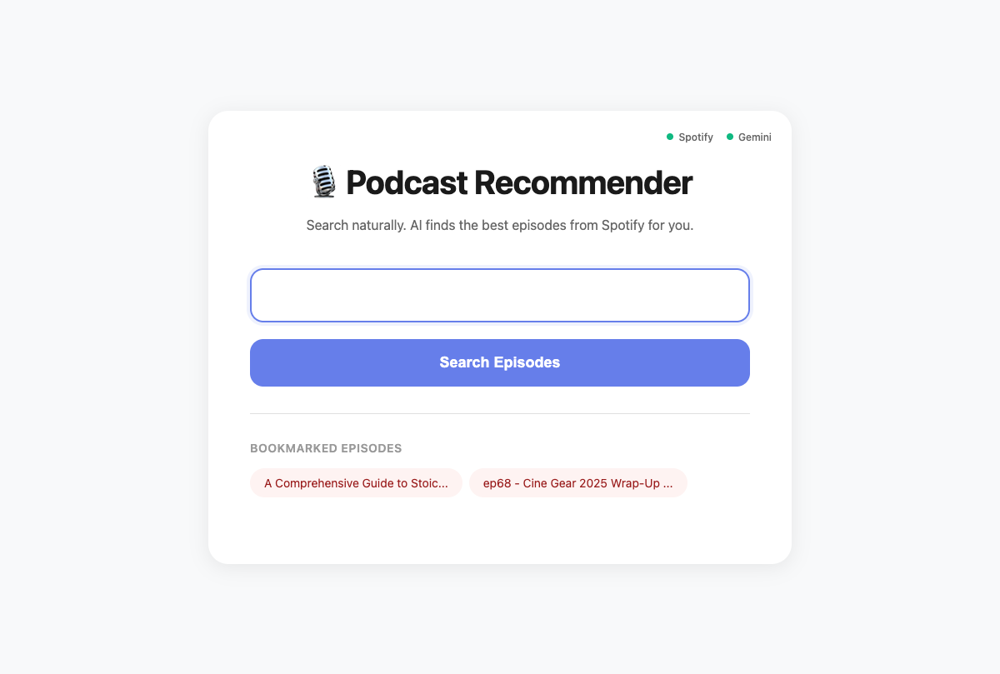

# 🎙️ AI-Powered Podcast Recommender

An intelligent Flask web application that uses AI to help you discover the perfect podcast episodes. Simply describe what you're looking for in natural language, and the AI will find and recommend the most relevant episodes from Spotify.

## ✨ Features

- **AI-Native Search**: Natural language queries are intelligently processed and optimized
- **Smart Query Optimization**: AI analyzes your query and creates optimized Spotify search queries considering keywords, recency, and relevance
- **Intelligent Filtering**: AI reasons about search results and selects the most relevant episodes based on your original intent
- **Beautiful UI**: Clean, modern interface for searching and browsing episodes
- **Direct Spotify Links**: One-click access to listen to episodes on Spotify
- **Bookmarking**: Save your favorite episodes for quick access later
- **AI Reasoning Display**: See why episodes were selected with AI-generated explanations

## 📸 Screenshots

### Homepage
The clean, minimal homepage with API status indicators and animated placeholder examples.


### Search Results
Example search results showing AI-selected relevant episodes with sorting, bookmarking, and expandable descriptions.


### Bookmarks
Bookmarked episodes are saved locally and displayed on the homepage for quick access.



## 🏗️ Architecture

The application uses a three-stage AI workflow:

1. **Query Reasoning**: AI analyzes your natural language query and creates an optimized Spotify search query
2. **Search Execution**: Searches Spotify's podcast database with the optimized query
3. **Result Filtering**: AI reasons about the original query and search results to select the most relevant episodes

## 🚀 Getting Started

### Prerequisites

- Python 3.8 or higher
- Spotify Developer Account (for API credentials)
- Google AI Studio Account (for Gemini API key)

### Installation

1. **Clone the repository**
   ```bash
   git clone <repository-url>
   cd podcast_recommender
   ```

2. **Create a virtual environment** (recommended)
   ```bash
   python -m venv venv
   source venv/bin/activate  # On Windows: venv\Scripts\activate
   ```

3. **Install dependencies**
   ```bash
   pip install -r requirements.txt
   ```

4. **Set up environment variables**
   
   Copy the example environment file:
   ```bash
   cp .env.example .env
   ```
   
   Edit `.env` and add your API credentials (see detailed instructions below):
   ```env
   SPOTIFY_CLIENT_ID=your_spotify_client_id_here
   SPOTIFY_CLIENT_SECRET=your_spotify_client_secret_here
   GEMINI_API_KEY=your_gemini_api_key_here
   # Optional: GEMINI_MODEL=gemini-2.5-flash (default)
   ```

## 🔑 Getting API Credentials

### Spotify API Credentials

Follow these steps to get your Spotify API credentials:

1. **Go to Spotify Developer Dashboard**
   - Visit [https://developer.spotify.com/dashboard](https://developer.spotify.com/dashboard)
   - Log in with your Spotify account (or create one if you don't have one)

2. **Create a New App**
   - Click the green **"Create an App"** button
   - Fill in the app details:
     - **App name**: Choose any name (e.g., "Podcast Recommender")
     - **App description**: Brief description (e.g., "AI-powered podcast discovery")
     - **Website**: Optional (can be your GitHub repo URL)
     - **Redirect URI**: Leave blank for this application
     - **What are you building?**: Select "I don't know" or "Web API"
   - Check the terms and conditions checkbox
   - Click **"Save"**

3. **Get Your Credentials**
   - Once your app is created, you'll see the app dashboard
   - Click **"Settings"** (gear icon) or find the **"Client ID"** and **"Client Secret"** section
   - Click **"View client secret"** to reveal your Client Secret
   - Copy both values:
     - **Client ID**: A long alphanumeric string
     - **Client Secret**: Another long alphanumeric string

4. **Add Credentials to .env**
   - Open your `.env` file
   - Paste the Client ID and Client Secret:
     ```env
     SPOTIFY_CLIENT_ID=paste_your_client_id_here
     SPOTIFY_CLIENT_SECRET=paste_your_client_secret_here
     ```

**Note**: The Spotify API uses Client Credentials flow for this app, which doesn't require user authentication. Your app will have access to public podcast data.

### Google Gemini API Key

Follow these steps to get your Gemini API key:

1. **Go to Google AI Studio**
   - Visit [https://aistudio.google.com/app/apikey](https://aistudio.google.com/app/apikey)
   - Sign in with your Google account (or create one if needed)

2. **Create an API Key**
   - Click the **"Create API Key"** button
   - If prompted, select or create a Google Cloud project (you can use the default)
   - Click **"Create API Key in new project"** or select an existing project
   - Your API key will be generated and displayed

3. **Copy Your API Key**
   - The API key will appear in a popup or on the page
   - Click **"Copy"** to copy the key
   - **Important**: Save this key immediately - you won't be able to see it again!

4. **Add API Key to .env**
   - Open your `.env` file
   - Paste the API key:
     ```env
     GEMINI_API_KEY=paste_your_api_key_here
     ```

**Note**: 
- The Gemini API has a free tier with generous limits for personal use
- Keep your API key secure and never commit it to version control
- You can manage and regenerate API keys from the [Google AI Studio](https://aistudio.google.com/app/apikey) dashboard
- **Model Selection**: By default, the app uses `gemini-2.5-flash`. You can change this by adding `GEMINI_MODEL=gemini-2.0-flash-exp` (or another model) to your `.env` file. See [Gemini models](https://ai.google.dev/models/gemini) for available options.

## 🏃 Running the Application

1. **Start the Flask server**
   ```bash
   python app.py
   ```

2. **Verify the server started**
   - You should see output like:
     ```
     * Running on http://127.0.0.1:5002
     ```
   - Check the API status indicators on the homepage:
     - Green dot = API connected
     - Red dot = API not connected (check your credentials)

3. **Open your browser**
   - Navigate to `http://localhost:5002`
   - You should see the search interface

4. **Start searching!**
   Enter a natural language query like:
   - "episodes about exercise for longevity"
   - "recent podcasts about climate change"
   - "beginner-friendly episodes about cryptocurrency"
   - "podcasts on artificial intelligence"

## 📖 Usage Examples

### Example Queries

The AI understands various query types:

- **Topic-based**: "episodes about machine learning"
- **Recency-focused**: "recent podcasts on climate change"
- **Specific interests**: "episodes about meditation and mindfulness"
- **Combined**: "AI podcasts from 2024 about GPT models"
- **Beginner-friendly**: "beginner-friendly episodes about cryptocurrency"
- **Timeless topics**: "episodes about stoic philosophy"

### How It Works

When you submit a query, the AI will:

1. **Analyze your intent**: Understand what you're truly looking for
2. **Optimize the search**: Create the best Spotify search query
3. **Find episodes**: Search Spotify's podcast database
4. **Filter and rank**: Select the most relevant episodes based on your original query
5. **Explain reasoning**: Show why these episodes were selected
6. **Present results**: Display episodes with descriptions, images, and direct Spotify links

## 🛠️ Technology Stack

- **Flask**: Web framework for the application
- **LangGraph**: AI workflow orchestration and state management
- **LangChain**: LLM integration and tool binding
- **Google Gemini 2.5 Flash**: AI reasoning and query optimization
- **Spotify Web API**: Podcast search and discovery
- **Python-dotenv**: Environment variable management

## 📁 Project Structure

```
podcast_recommender/
├── app.py                 # Main Flask application and AI workflow
├── templates/
│   ├── index.html         # Home page with search form
│   └── results.html       # Results display page
├── requirements.txt       # Python dependencies
├── .env.example          # Example environment variables template
├── .env                  # Your environment variables (not in git)
├── .gitignore            # Git ignore file
└── README.md             # This file
```

## 🔒 Security Notes

- **Never commit your `.env` file** to version control
- The `.env` file is already in `.gitignore`
- Keep your API keys secure and rotate them regularly
- For production deployment, use environment variables or a secrets management service
- Don't share your API keys publicly or in screenshots

## 🐛 Troubleshooting

### "Missing required environment variables" error

**Problem**: The app can't find your API credentials.

**Solutions**:
- Make sure your `.env` file exists in the project root directory
- Check that variable names match exactly (case-sensitive):
  - `SPOTIFY_CLIENT_ID`
  - `SPOTIFY_CLIENT_SECRET`
  - `GEMINI_API_KEY`
- Verify there are no extra spaces or quotes around the values
- Make sure you copied the `.env.example` file and renamed it to `.env`

### "Could not obtain Spotify token" error

**Problem**: Can't authenticate with Spotify API.

**Solutions**:
- Verify your Spotify Client ID and Secret are correct
- Check that your Spotify app is active in the [developer dashboard](https://developer.spotify.com/dashboard)
- Make sure there are no extra spaces or characters in your credentials
- Try regenerating your Client Secret in the Spotify dashboard

### "No results found" or empty results

**Problem**: Search returns no episodes.

**Solutions**:
- Try rephrasing your query with different keywords
- Some topics may have limited podcast coverage on Spotify
- Make your search terms more specific or more general
- Check that your Spotify API credentials are working (green dot on homepage)

### API Status shows red dots

**Problem**: One or both API status indicators are red.

**Solutions**:
- **Spotify (red)**: Check your Client ID and Secret in `.env`
- **Gemini (red)**: Check your API key in `.env`
- Make sure you saved the `.env` file after adding credentials
- Restart the Flask server after updating `.env`
- Verify credentials are correct (no typos, complete keys)

### Port already in use error

**Problem**: `Address already in use` when starting the app.

**Solutions**:
- Another process is using port 5002
- Change the port in `app.py` (last line): `app.run(debug=True, host='127.0.0.1', port=5003)`
- Or stop the other process using port 5002

### Module not found errors

**Problem**: `ModuleNotFoundError` when running the app.

**Solutions**:
- Make sure your virtual environment is activated
- Install dependencies: `pip install -r requirements.txt`
- Check that you're using Python 3.8 or higher: `python --version`

## 📝 Development Notes

### Key Design Decisions

- **Lazy LLM Initialization**: The LLM is only created when needed to reduce startup time
- **Global Spotify Token**: Token is cached globally and refreshed automatically
- **AI-Native Architecture**: The prompt is the product - all logic is driven by AI reasoning
- **First Principles Approach**: No hardcoded rules, AI reasons from first principles

### Code Structure

- **State Management**: Uses LangGraph's TypedDict for type-safe state
- **Error Handling**: Graceful fallbacks at each stage of the workflow
- **JSON Parsing**: Robust parsing with markdown code block extraction
- **Template Filters**: Custom Jinja2 filters for duration formatting

## 🤝 Contributing

Contributions are welcome! Please feel free to submit a Pull Request.

## 📝 License

This project is open source and available under the MIT License.

## 🙏 Acknowledgments

- Spotify for the podcast API
- Google for the Gemini AI model
- LangChain and LangGraph communities for excellent tooling

## 📧 Support

For issues, questions, or suggestions, please open an issue on GitHub.
